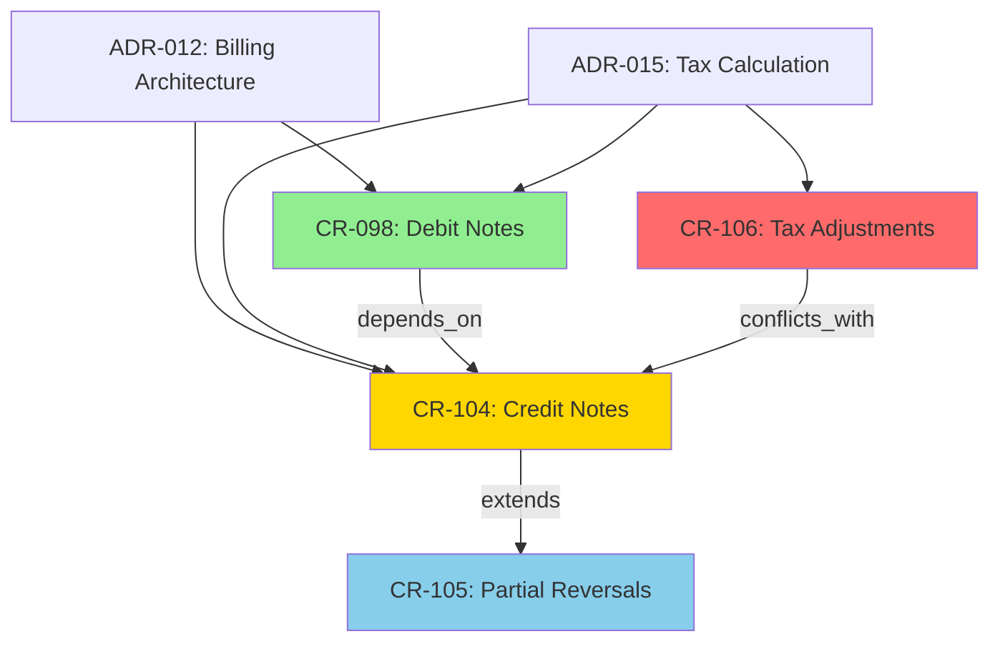

# Ejemplo: Proyecto Billing System

Este ejemplo muestra cómo se vería un proyecto real usando Ztructure.

---

## Estructura del proyecto

```
billing-system/
├── src/
│   ├── billing/
│   │   ├── invoice.service.ts
│   │   ├── tax-calculator.ts
│   │   └── ...
│   ├── auth/
│   └── reporting/
├── .project-spec/
│   ├── changes/
│   │   ├── CR-098.yaml    # debit notes (implementado)
│   │   ├── CR-104.yaml    # credit notes (en progreso)
│   │   ├── CR-105.yaml    # partial reversals (propuesto)
│   │   └── CR-106.yaml    # tax adjustments (propuesto)
│   ├── decisions/
│   │   ├── ADR-001.yaml   # usar NestJS
│   │   ├── ADR-008.yaml   # PostgreSQL con Prisma
│   │   ├── ADR-012.yaml   # arquitectura de billing
│   │   └── ADR-015.yaml   # cálculo de impuestos
│   ├── constraints/
│   │   ├── CONSTRAINT-001.yaml  # integridad histórica
│   │   └── CONSTRAINT-002.yaml  # audit obligatorio
│   ├── domains/
│   │   ├── DOMAIN-billing.yaml
│   │   ├── DOMAIN-auth.yaml
│   │   └── DOMAIN-reporting.yaml
│   ├── config.yaml
│   └── graph.db (SQLite)
└── README.md
```

---

## CR-098: Debit Notes (implementado)

```yaml
# .project-spec/changes/CR-098.yaml
schema: cr/v1
id: CR-098
status: implemented

proposed_at: 2025-01-15
approved_at: 2025-01-18
implemented_at: 2025-02-01
author: maria

domain: billing
summary: "Agregar debit notes para ajustes positivos de facturación"
description: |
  Las debit notes permiten agregar cargos a una factura existente
  sin necesidad de reemitir la factura completa.

affects:
  entities: [invoice, debit_note, tax_calculation]
  files: [src/billing/*, src/tax/*]
  apis:
    - POST /debit-notes
    - GET /invoices/:id/debit-notes

acceptance_criteria:
  - "Debit note genera asiento contable positivo"
  - "Impuestos se recalculan automáticamente"
  - "Auditoría registra operación completa"

relationships:
  affects_decision: [ADR-012]

implementation:
  branch: feature/debit-notes
  pr: 189
  commits: [a1b2c3d, e4f5g6h, i7j8k9l]
```

---

## CR-104: Credit Notes (en implementación)

```yaml
# .project-spec/changes/CR-104.yaml
schema: cr/v1
id: CR-104
status: implementing

proposed_at: 2025-05-02
approved_at: 2025-05-03
author: tano
reviewers: [maria, pedro]

domain: billing
summary: "Agregar credit notes para reversión de facturas"

description: |
  Sistema de credit notes que permite revertir facturas emitidas.
  
  Casos de uso:
  - Devoluciones de productos
  - Errores de facturación
  - Ajustes posteriores por disputas
  
  Características:
  - Reversión parcial o total
  - Recalculo automático de impuestos
  - Preserva reportes históricos
  - Aprobación requerida para montos > $5000

affects:
  entities: [invoice, credit_note, tax_calculation, report_adjustment]
  files: [src/billing/*, src/tax/*, src/reporting/*]
  apis:
    - POST /credit-notes
    - GET /invoices/:id/credit-notes
    - POST /credit-notes/:id/approve

constraints:
  - CONSTRAINT-001  # preserve_historical_integrity
  - CONSTRAINT-002  # audit_trail_required

acceptance_criteria:
  - title: "Reversión contable"
    description: "Credit note genera asiento contable reversible"
    
  - title: "Recalculo de impuestos"
    description: "IVA y otros impuestos se recalculan automáticamente"
    
  - title: "Reportes históricos"
    description: "Los reportes históricos permanecen sin cambios"
    
  - title: "Auditoría completa"
    description: "Registrar: usuario, timestamp, reason, monto"
    
  - title: "Workflow de aprobación"
    description: "Credit notes > $5000 requieren aprobación explícita"
    
  - title: "Soporte parcial"
    description: "Permitir reversión de monto parcial"

relationships:
  depends_on: [CR-098]  # debit notes debe existir
  affects_decision: [ADR-012, ADR-015]

implementation:
  branch: feature/credit-notes
  pr: null
  commits: []
```

---

## ADR-012: Arquitectura de Billing

```yaml
# .project-spec/decisions/ADR-012.yaml
schema: adr/v1
id: ADR-012
status: active

decided_at: 2024-06-20
authors: [maria, tano]

context: |
  El sistema de facturación necesita:
  - Soportar múltiples tipos de documentos (facturas, debit/credit notes)
  - Mantener integridad contable
  - Integrarse con el sistema de impuestos
  - Escalar para procesar 100k+ documentos/mes

decision: |
  Arquitectura basada en:
  
  1. Domain Events para desacoplamiento
     - Cada documento emite eventos: created, approved, cancelled
     - Los módulos interesados se suscriben
     
  2. Repository pattern con Prisma
     - Abstracción sobre DB
     - Transacciones explícitas para operaciones complejas
     
  3. Document sequence como servicio separado
     - Numeración automática por tipo
     - Sin gaps, con locks optimistas
     
  4. Tax calculation como servicio independiente
     - Plugins por jurisdicción
     - Caché de resultados

alternatives:
  - name: "Monolito con llamadas directas"
    rejected_because: "Acoplamiento excesivo, difícil de testear"
    
  - name: "Microservicios por documento"
    rejected_because: "Overhead operacional para el volumen actual"

consequences:
  positive:
    - "Testeabilidad mejorada"
    - "Extensibilidad para nuevos tipos de documentos"
    - "Separación clara de responsabilidades"
  negative:
    - "Más complejidad inicial"
    - "Debugging más difícil por events"

relationships:
  affects_crs: [CR-045, CR-067, CR-087, CR-098, CR-104]
  related_adrs: [ADR-008, ADR-015]
  
tags: [billing, architecture, events, ddd]
```

---

## CONSTRAINT-001: Integridad Histórica

```yaml
# .project-spec/constraints/CONSTRAINT-001.yaml
schema: constraint/v1
id: CONSTRAINT-001
name: "preserve_historical_integrity"
severity: hard

description: |
  Los documentos fiscales emitidos nunca pueden ser eliminados 
  ni modificados directamente.
  
  Solo se permiten operaciones que:
  1. Agreguen información (debit notes)
  2. Reviertan información de manera trazable (credit notes)
  3. Mantengan la secuencia numérica sin gaps

scope:
  domains: [billing, accounting, audit]
  entities: [invoice, debit_note, credit_note, tax_calculation]

enforcement:
  - code_review: required
  - database_constraint: true
  - migration_check: required
  - ci_validation: required

origin:
  reason: "Requerimiento legal AFIP RG 4004-E"
  decided_in: ADR-003
  date: 2024-02-15
```

---

## Query de conflictos

```bash
$ spec query "potential conflicts in billing"

Analizando billing domain...

CR-104 (credit notes) vs CR-098 (debit notes):
  ℹ Dependencia declarada: CR-104 depends_on CR-098
  ✓ No hay conflicto, es dependencia explícita

CR-104 (credit notes) vs CR-087 (tax calculation refactor):
  ⚠ Posible conflicto detectado
    - CR-087 modificó TaxCalculationService (2024-11)
    - CR-104 asume interfaz anterior
    - Revisar: src/tax/tax-calculator.ts
    
CR-105 (partial reversals) vs CR-104 (credit notes):
  ℹ CR-105 extiende CR-104
    - CR-105 debe esperar a que CR-104 termine
    - Status CR-104: implementing (30%)

CR-106 (tax adjustments) vs CR-087:
  ✗ Conflicto confirmado
    - Ambos modifican TaxCalculationService
    - CR-106 propone interfaz incompatible con CR-087
    - Resolver antes de aprobar CR-106

Recomendaciones:
  1. Revisar impacto de CR-087 en CR-104
  2. Rechazar CR-106 hasta resolver conflicto con CR-087
  3. Bloquear CR-105 hasta CR-104 implemented
```

---

## Query temporal

```bash
$ spec query "why did we choose JWT auth?"

Buscando en decisions...

ADR-012: "Sistema de autenticación" (2024-03-15)
  Decisión: JWT con refresh tokens y rotación automática
  
  Contexto:
  - Necesitábamos escalar horizontalmente
  - Sessions requerían sticky sessions o shared store
  - Mobile app necesitaba stateless auth
  
  Alternativas rechazadas:
  - Sessions: no escala sin shared store
  - Opaque tokens: cada request requiere DB lookup
  
  Consecuencias:
  + Stateless para access tokens
  + Escalabilidad horizontal nativa
  - Refresh tokens requieren storage
  - Revocación no inmediata (15 min window)

Relacionado:
  CR-045: Implementar JWT service
  CR-067: Refresh token rotation
  CR-087: Blacklist en Redis
```

---

## Grafo visual

```bash
$ spec graph billing --format mermaid

# Output:
```



---

## Sync de CR-104

```bash
$ spec sync CR-104

Comparando spec vs implementación...

Spec:
  ✓ Entidad CreditNote
  ✓ POST /credit-notes
  ✓ GET /invoices/:id/credit-notes
  ✓ Aprobación arriba de $5000
  
Gaps:
  ⚠ Auditoría sin campo 'reason' (required en spec)
  ⚠ Solo recalcula IVA, no otros impuestos
  
Extra en código:
  + Validación de límite diario $50k
  + Endpoint GET /credit-notes/search
  
Acciones:
  [1] Agregar campo 'reason' a audit_log
  [2] Extender recalculo para todos los impuestos
  [3] ¿Actualizar spec con validación de $50k?
  [4] ¿Documentar endpoint search en spec?

Proceed? [1-4 or 'all' or 'skip']: 1,2
```
